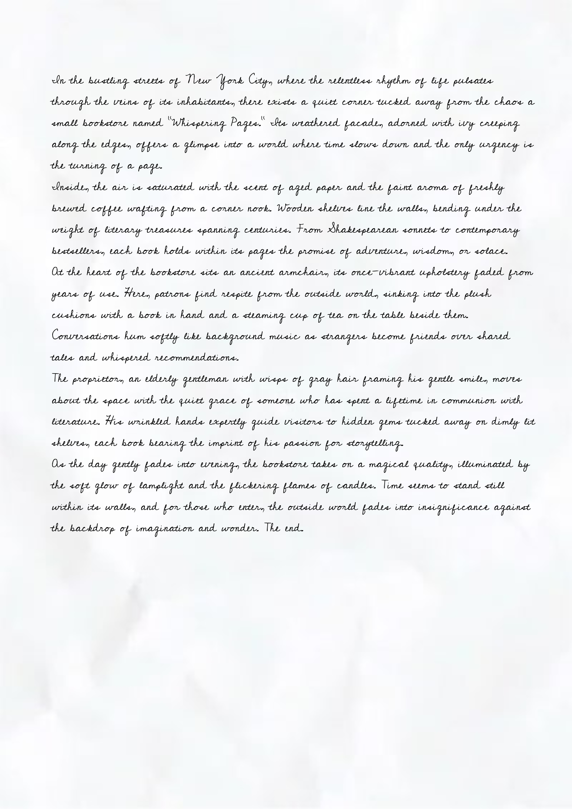
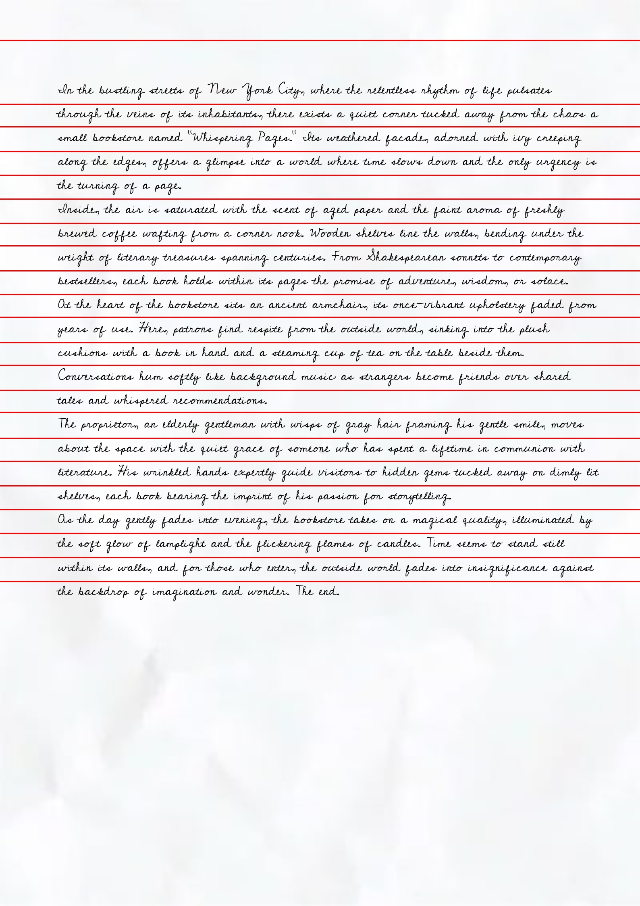

# Handwritten Word Splitter

A pixel-based algorithm that segments a text image (handwritten or printed) into individual word images. No machine learning — only classical image processing with NumPy and OpenCV.

## How It Works

The algorithm runs in two stages:

1. **Line segmentation** — counts black pixels row by row. Rows with zero black pixels mark gaps between lines. The midpoint of each gap becomes a horizontal split boundary.
2. **Word segmentation** — for each line, counts black pixels column by column. Gaps between words are wider than gaps between letters. The algorithm finds the inflection point in gap-width distribution to distinguish word spaces from letter spaces, then splits accordingly.

For imperfect handwriting (tight or inclined lines with no clean zero-pixel rows), set `usePerfectDivide = True` in `main.py` to find the minimum-density row within each inter-line region instead.

## Preview

Red horizontal lines show where the image would be split into text lines (no cropping is performed).

**Before** (original):



**After** (split preview):



## File Structure

```
handwrittenwordsplitter/
├── utils.py         # Binarization, pixel counting, cropping helpers
├── analysis.py      # Split-point detection logic
├── splitter.py      # Full splitting pipeline
├── visualize.py     # Preview horizontal split lines without cropping
├── main.py          # Entry point — set image path and options here
├── requirements.txt
└── test-before.jpg  # Sample input image
```

## Installation

```bash
pip install -r requirements.txt
```

## Usage

Edit the settings at the top of `main.py`:

```python
imagePath = "test-before.jpg"
outputDir = "crops"
afterPath = "test-after.jpg"
usePerfectDivide = False
runPreview = True
runSplit = True
```

Then run:

```bash
python main.py
```

- `runPreview` — reads `imagePath` and saves `test-after.jpg` with red horizontal line markers (the before image is your input file as-is).
- `runSplit` — writes individual word images to `outputDir`.

## Dependencies

- [opencv-python](https://pypi.org/project/opencv-python/) — image I/O and morphological operations
- [numpy](https://numpy.org/) — pixel-level array computation
- [Pillow](https://python-pillow.org/) — image drawing utilities
- [toolz](https://toolz.readthedocs.io/) — functional pipeline composition